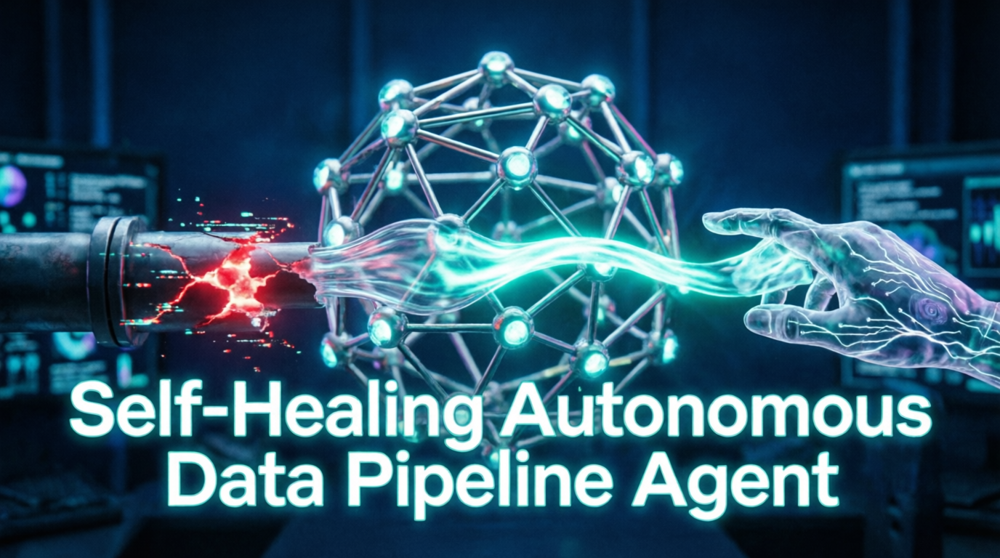
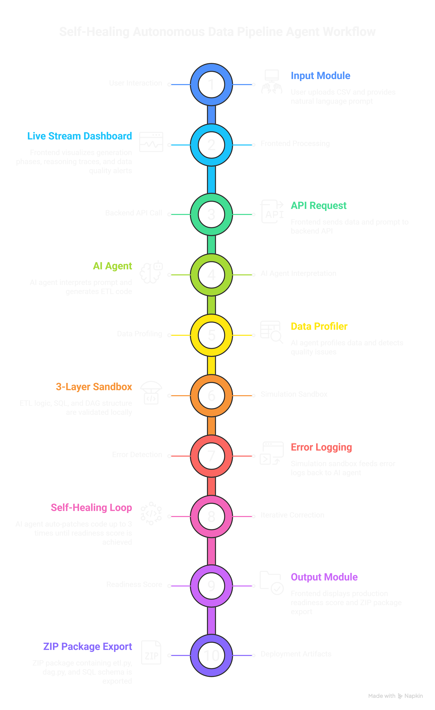

# 🔄 Self-Healing Autonomous Data Pipeline Agent

 



**An AI-powered system designed to solve the biggest bottlenecks in DataOps: slow pipeline prototyping and rigid, breakable ETL code.**

---

## 🎥 Demo Video

[](https://github.com/Maddy-Das/Self-Healing-Autonomous-Data-Pipeline-Agent/blob/main/doc/demo.mp4)


https://github.com/user-attachments/assets/f6c2f2aa-6c5f-4157-aa0d-a8b9693dee5f


---

## ⚠️ The Problem

1. **Slow Prototyping:** Traditional ETL development is time-consuming. Data engineers must manually parse schemas, write complex transformation logic, wire orchestration DAGs, and validate SQL queries.
2. **Brittle LLM Pipelines:** Standard AI code generation without validation is unreliable. Most LLM-generated data pipelines fail in real environments due to syntax errors, runtime bugs, or unexpected data quality issues (e.g., null spikes, type mismatches).

---

## 🚀 The Solution

This system acts as an **Autonomous Self-Healing Agent**:

- **Meaningful GLM 5.1 Reasoning:** GLM 5.1 doesn't just write a single script. It interprets intent from natural language and a sample CSV, translating them into structured ETL planning targets. It then coordinates the generation of interconnected artifacts: Python ETL logic, SQL schemas, and DAG-ready orchestration scaffolding.
- **3-Layer Sandbox Validation:** Before any code is deployed, the agent profiles the data and validates the generated ETL pipelines inside a secure, local execution sandbox.
- **Iterative Self-Healing Loop:** If validation fails (syntax exceptions, failed data rules, missing dependencies), the error logs are fed back to GLM 5.1 as actionable diagnostics. The agent autonomously patches the code (up to 3 correction passes), checks the readiness score, and only exports when the pipeline is production-ready.

---

## 🏗️ Architecture



### Workflow Summary
1. **Input Module:** User uploads CSV + natural language prompt.
2. **AI Agent (GLM 5.1):** Interprets intent and generates ETL components.
3. **Data Profiler:** Detects data quality issues and schema constraints.
4. **Simulation Sandbox:** 3-layer local validation for ETL/SQL/DAG logic.
5. **Self-Healing Loop:** Feeds error logs back to the AI for iterative correction.
6. **Output Module:** Computes a production-readiness score and exports a deployable ZIP package (`etl.py`, `dag.py`, `schema.sql`).

---

## 🛠️ Tech Stack

- **AI Engine:** GLM 5.1 API (Reasoning, planning, generation, and self-healing correction)
- **Backend:** Python (Core agent logic, ETL generation, sandbox validation)
- **Frontend:** JavaScript + CSS (Live streaming dashboard & reasoning traces)
- **Infrastructure:** HCL & Docker (Containerized sandbox runtime)

---

## 📦 Installation

```bash
git clone https://github.com/Maddy-Das/Self-Healing-Autonomous-Data-Pipeline-Agent.git
cd Self-Healing-Autonomous-Data-Pipeline-Agent
```

Create and activate a virtual environment:

```bash
python -m venv .venv

# Windows
.venv\Scripts\activate
# macOS/Linux
source .venv/bin/activate
```

Install dependencies:

```bash
pip install -r requirements.txt
```

---

## ▶️ How to Run

Start the backend application:

```bash
python app.py
```

*(If you have a separate frontend server)*:
```bash
cd frontend
npm install
npm run dev
```

1. Open your local browser (e.g., `http://localhost:3000`).
2. Upload a sample CSV.
3. Enter your natural-language ETL prompt.
4. Watch the live dashboard as the agent generates, tests, and self-heals your pipeline!

---
